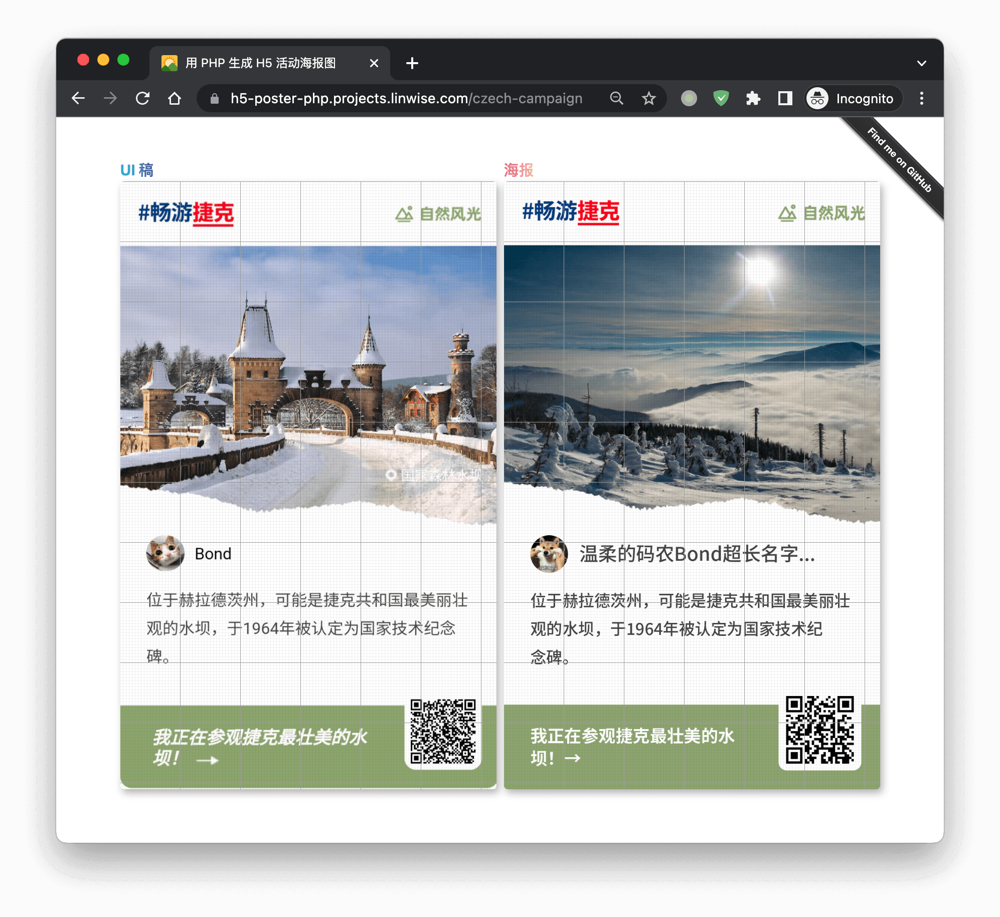

# 用 PHP 生成 H5 活动海报图

> 依赖: https://image.intervention.io/v2 \
> 注意参考[这里](https://image.intervention.io/v2/introduction/installation)安装依赖.

## 示例

[Demo](https://h5-poster-php.projects.linwise.com/czech-campaign)

## 功能

- 网格线是为了方便做布局加了一个伪元素.
- 多行文本时, 打断了文本一行一行画上去的, 假装折行了.
- 圆图像是在矩形图形上再盖一个有圆形中空图形生成的.

## 如何使用

- 克隆项目, 直接参考 [CzechCampaignController.php](app/Http/Controllers/CzechCampaignController.php) 开发新的海报图.
- 图片都放在了 `public/static` 目录了.

## 已知限制

- 多行文本时, 非等宽字体文本的右边会显得对不齐, 没法指定一个容器让直接往里放, 超出自然折行.
- 圆图低不是单色时要把盖在上面的有圆形中空的图形精细处理一下, 使盖住后要正好跟底拼接好, 会麻烦点, 哈哈哈.
- 做不了斜体字.

## 广告时间

> 窝在找工作, 求速速带走~ 🙋‍♂️ 关于我: https://github.com/shrekuu/resume
